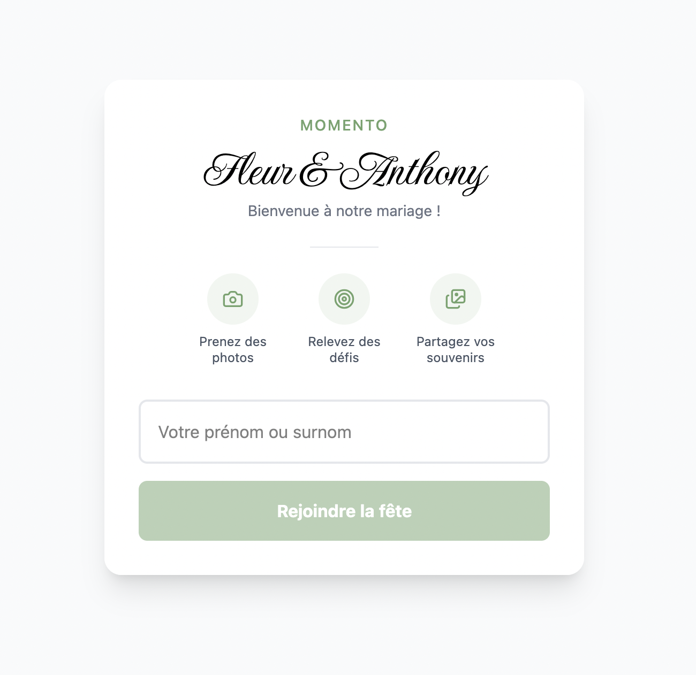
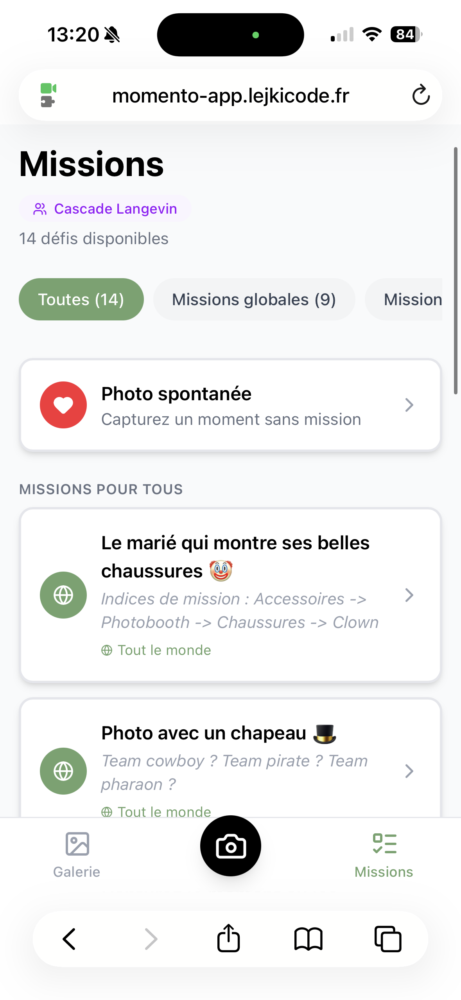

# 📸 Momento

> Le photomaton nouvelle génération pour vos mariages et événements.
> Pas de borne, pas de matériel : le téléphone de chaque invité devient l'appareil photo.

Momento transforme les invités d'un événement en photographes. Un simple **QR Code** sur la table, un **pseudo**, et chacun peut capturer l'instant depuis son propre téléphone. Toutes les photos atterrissent dans une **galerie partagée**, en temps réel, et les mariés repartent avec des centaines de souvenirs vus à travers les yeux de leurs proches.

---

## 🏆 Éprouvé en conditions réelles

Momento n'est pas qu'un projet de démo : l'application a été **déployée en production pour un vrai mariage**. 💍

- 👥 **45 invités** connectés au cours de la soirée
- 📸 **Plus de 170 photos** prises et partagées pendant l'événement
- 🎉 **Un carton** : adoptée naturellement par les invités, sans installation ni explication, du plus jeune au plus âgé

Une preuve concrète que l'expérience tient la route auprès de vrais utilisateurs, dans le feu de l'action d'un événement réel.

---

## ✨ Le concept

Les photomatons classiques sont chers, encombrants, et limités à un seul point de l'événement. Momento repense l'expérience :

1. **Scan** — Les invités scannent le QR Code posé sur leur table.
2. **Pseudo** — Ils choisissent un pseudo. Pas de compte, pas de mot de passe.
3. **Photo** — Ils prennent des photos directement depuis le navigateur de leur téléphone.
4. **Partage** — Les clichés rejoignent instantanément une galerie commune.

Et pour pimenter la soirée : les **missions photo** 🎯 — des défis ludiques (« Prends une photo avec un inconnu », « Capture le premier slow »…) que les invités peuvent relever et associer à leurs clichés.

À la fin, les mariés disposent d'un **back-office** complet pour modérer, organiser en albums, et partager une sélection via un simple lien public.

---

## 🎁 Fonctionnalités

### Côté invité
- 🔐 **Connexion sans friction** via QR Code signé + pseudo
- 📷 **Capture photo** directement dans le navigateur (WebRTC), optimisée en WebP haute qualité
- 🖼️ **Galerie partagée** avec filtres par table et par mission, vue plein écran
- 🎯 **Missions photo** : des défis à relever pendant l'événement
- 📲 **PWA installable** : Momento s'ajoute à l'écran d'accueil comme une vraie app

### Côté organisateur (back-office `/admin`)
- 📊 **Tableau de bord** avec les statistiques de l'événement
- 🪑 **Gestion des tables** et génération des **QR Codes** à imprimer
- 👥 **Gestion des invités**
- 🎯 **Création de missions** (globales ou spécifiques à une table)
- ✅ **Modération des photos** (favoris, suppression)
- 📁 **Albums** organisables, partageables via un **lien public** (sans authentification)
- 💞 **Espace dédié aux mariés**

---

## 🖼️ Aperçu

<table>
  <tr>
    <td align="center" width="50%">
      <br/>
      <em>Connexion invité — un pseudo, et c'est parti</em>
    </td>
    <td align="center" width="50%">
      <br/>
      <em>Missions photo — les défis à relever pendant la soirée</em>
    </td>
  </tr>
</table>

> 🛠️ D'autres captures (galerie, caméra, back-office admin) arriveront avec une **version démo aux données anonymisées**, afin de ne jamais exposer les vraies photos des invités.

---

## 🛠️ Stack technique

| Côté | Technologies |
|------|--------------|
| **Frontend** | React 19, Vite 7, TypeScript, Tailwind CSS v4, React Router 7, PWA (vite-plugin-pwa) |
| **Backend** | AdonisJS 6, Lucid ORM, Drive (stockage fichiers), Auth (access tokens) |
| **Base de données** | PostgreSQL 15 |
| **Infra** | Docker Compose, Caddy (reverse proxy / HTTPS en prod) |

**Points d'architecture notables :**
- Authentification invité par **URL signée AdonisJS** encodée dans le QR Code — aucun mot de passe à gérer.
- Stockage des photos sur le **système de fichiers** via le driver Drive (`fs`), servies sur `/uploads`.
- Images converties et compressées en **WebP** côté client avant upload, avec **retry automatique** sur erreur réseau.
- Partage d'albums via un **jeton public** dédié, indépendant de l'authentification invité.

---

## 🚀 Démarrage rapide

### Prérequis
- Node.js 20+
- Docker (pour PostgreSQL)

### 1. Lancer la base de données

```bash
docker compose up -d
```

PostgreSQL démarre sur le port `5432`.

### 2. Backend (AdonisJS)

```bash
cd backend
npm install
cp .env.example .env        # puis renseigner les variables (voir ci-dessous)
node ace migration:run      # créer les tables
npm run dev                 # serveur sur http://localhost:3333
```

### 3. Frontend (React / Vite)

```bash
cd frontend
npm install
npm run dev                 # app sur http://localhost:5173
```

---

## ⚙️ Configuration

Les variables sensibles ne sont **jamais** committées. Créez vos fichiers `.env` à partir des exemples.

### Backend (`backend/.env`)

| Variable | Description |
|----------|-------------|
| `DB_HOST` / `DB_PORT` / `DB_USER` / `DB_PASSWORD` / `DB_DATABASE` | Connexion PostgreSQL |
| `APP_KEY` | Clé de chiffrement AdonisJS |
| `DRIVE_DISK` | Driver de stockage (`fs` en local) |
| `ADMIN_TOKEN` | Jeton d'accès au back-office admin |
| `FRONTEND_URL` | URL du frontend (liens d'albums, CORS) |

### Frontend (`frontend/.env`)

| Variable | Description |
|----------|-------------|
| `VITE_API_URL` | URL de l'API backend (défaut : `http://localhost:3333`) |

> ⚠️ Les valeurs de production (secrets, mots de passe, clés) sont conservées hors du dépôt.

---

## 📂 Structure du projet

```
Momento/
├── backend/                 # API AdonisJS 6
│   ├── app/
│   │   ├── models/          # Table, Guest, Photo, Mission, Album
│   │   └── controllers/     # Routes invité + back-office admin
│   ├── database/migrations/
│   └── storage/uploads/     # Photos stockées localement
├── frontend/                # App React + PWA
│   └── src/
│       ├── pages/           # Galerie, Caméra, Missions, Connexion…
│       ├── admin/           # Back-office organisateur
│       ├── components/
│       └── services/        # Client API (Axios)
├── docker-compose.yml       # PostgreSQL (dev)
├── docker-compose.prod.yml  # Stack de production
└── Caddyfile                # Reverse proxy HTTPS (prod)
```

---

## 🗺️ Modèle de données

- **Table** — un groupe d'invités (une table à l'événement)
- **Guest** — un invité rattaché à une table (auth par token)
- **Photo** — un cliché, lié à un invité et optionnellement à une mission
- **Mission** — un défi photo, global ou spécifique à une table
- **Album** — une sélection de photos partageable via lien public

---

## 📜 Scripts utiles

### Backend
```bash
npm run dev          # serveur avec HMR
npm run build        # build production
npm run typecheck    # vérification des types
npm run test         # tests Japa
node ace migration:run / migration:rollback
```

### Frontend
```bash
npm run dev          # dev server Vite
npm run build        # build production
npm run lint         # ESLint
```

---

<p align="center">
  <em>Momento — capturez l'événement à travers les yeux de tous vos invités. 💞</em>
</p>
